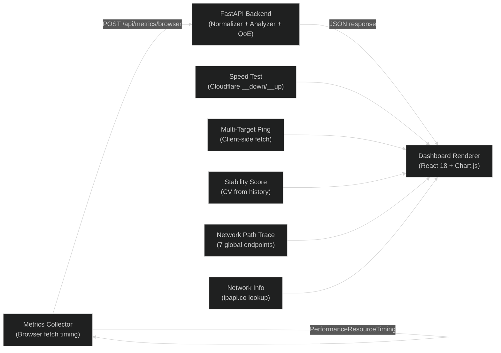
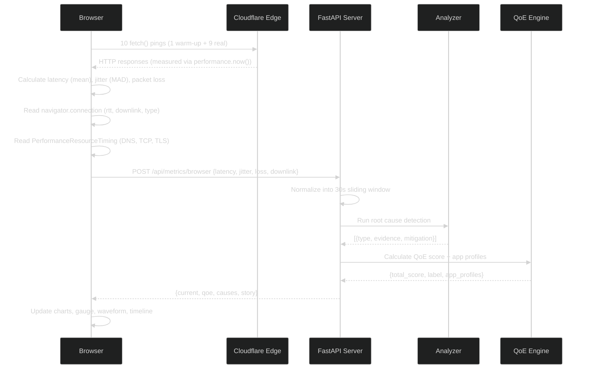
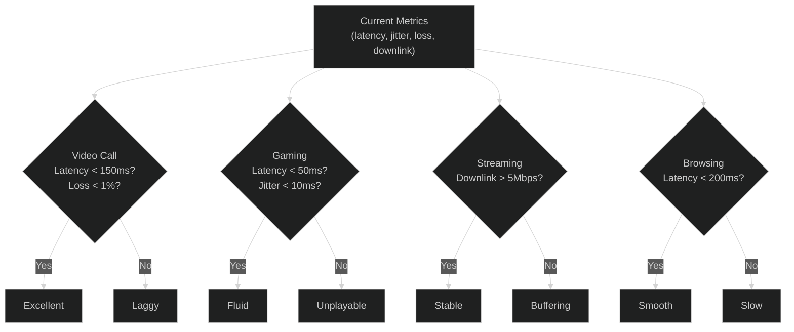
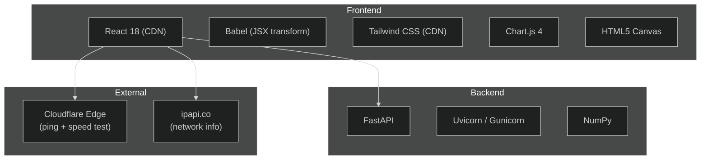

# NetPulse

> **A real-time, browser-based WiFi intelligence platform that continuously monitors your network, scores connection quality, detects root causes of degradation, and delivers actionable diagnostics. Zero installs. Fully cloud-deployable.**

> Live: [cognita-netpulse.netlify.app](https://cognita-netpulse.netlify.app)

---

## Architecture: Client-Server Measurement Pipeline



**Key design decision:** All metric collection happens in the browser using `fetch()` timing against Cloudflare edge servers (300+ global PoPs). The browser measures latency to the nearest edge, not to the distant cloud server. This ensures the dashboard reflects your actual local network quality.

| Component | Runs On | Reason |
|---|---|---|
| Latency, jitter, packet loss measurement | Browser | Must measure from user's actual network location |
| Speed test (download + upload) | Browser via Cloudflare | Real throughput to nearest CDN edge, not throttled backend |
| Multi-target ping | Browser | Measures user's latency to each global endpoint |
| Stability score | Browser | Computed from client-side history array (coefficient of variation) |
| Network path trace | Browser | Pings 7 global endpoints from user's network |
| JSON export | Browser | Downloads from in-memory state as Blob |
| Normalization and windowing | Server | Stateful 30-second sliding window across requests |
| Root cause analysis | Server | Needs historical context from multiple metric frames |
| QoE scoring | Server | Complex weighted algorithm with app-specific profiles |
| Story generation | Server | Rule-based engine needs full analysis context |

---

## Data Flow: What Happens Every 3 Seconds



---

## Feature Breakdown

### Core Intelligence Engine

| Feature | How It Works | Output |
|---|---|---|
| **QoE Score** | Weighted formula: `0.35*latency + 0.25*jitter + 0.25*loss + 0.15*throughput`. Each sub-metric scored 0-100. | Animated SVG gauge (Good/Moderate/Poor) |
| **Root Cause Analysis** | Pattern matching on windowed metrics: high latency + low throughput = congestion, jitter spikes = interference, weak signal = distance | Array of `{type, evidence, mitigation}` displayed as cards |
| **WiFi Story Mode** | Rule-based narrative engine in `agent/qoe.py`. No AI API calls. Generates plain-English descriptions based on QoE score, current metrics, and detected issues. | "Your network is performing well with 28ms latency..." |
| **App Profiler** | Evaluates connection fitness for 4 application types using threshold rules (e.g., Gaming needs <50ms latency, <10ms jitter) | Per-app labels: Excellent/Fluid/Stable vs Laggy/Unplayable/Buffering |
| **What-If Simulator** | Three sliders (latency 0-500ms, jitter 0-100ms, loss 0-20%) feed into the same QoE formula to predict quality under hypothetical conditions | Real-time predicted QoE score and label |

### QoE Scoring Formula

```
latency_score  = max(0, 100 - (latency_ms / 2))
jitter_score   = max(0, 100 - (jitter_ms * 2))
loss_score     = max(0, 100 - (loss_pct * 10))
throughput_score = min(100, (throughput_mbps / 50) * 100)

QoE = 0.35 * latency_score + 0.25 * jitter_score + 0.25 * loss_score + 0.15 * throughput_score
```

| Score Range | Label | Color |
|---|---|---|
| 75 - 100 | Good | Green `#10B981` |
| 45 - 74 | Moderate | Yellow `#F59E0B` |
| 0 - 44 | Poor | Red `#EF4444` |

---

### Real-Time Monitoring (6 Components)

| Component | Technology | What It Shows |
|---|---|---|
| **Live Metrics Cards** | React state + 3s polling | Current latency, jitter, packet loss, downlink with inline sparkline trends (last 20 readings) |
| **Signal Waveform** | HTML5 Canvas with `requestAnimationFrame` | Animated wave whose amplitude = signal strength, frequency = jitter, color = packet loss severity |
| **Historical Charts** | Chart.js 4 (line charts) | 4 graphs: latency (ms), jitter (ms), packet loss (%), QoE score (%). 60-point rolling window with auto-scroll |
| **Sparkline Trends** | Inline SVG polyline | 20-point mini-charts embedded in each stat card header |
| **Latency Heatmap** | CSS grid of colored cells | Each cell = one measurement. Color: `<30ms` green, `30-100ms` amber, `>100ms` red |
| **Session Timeline** | Scrollable event log | Chronological record of quality changes, network transitions, and root cause alerts |

---

### Advanced Diagnostics (5 Components)

| Component | Algorithm | Details |
|---|---|---|
| **Anomaly Detection** | Z-score analysis (threshold > 2.0) over last 30 latency readings | Anomalies shown as red dots on charts + flash animation on stat cards + count display |
| **Stability Score** | Coefficient of variation: `stability = 100 - (0.5*latency_CV + 0.3*jitter_CV + 0.2*avg_loss*10)` | Labels: Rock Solid (85+), Stable (65+), Fluctuating (40+), Unstable (<40) |
| **Loss Pattern Analysis** | Scans history for 3+ consecutive loss events (burst) vs isolated events (random) | Burst = hardware issue, Random = congestion, Mixed = both |
| **Network Path Trace** | Browser pings 7 global endpoints (Cloudflare, Google, AWS, Microsoft, Fastly) with 3-ping median per target | Displayed in natural order with latency bars. Not sorted (preserves network topology) |
| **DNS/TLS/TCP Breakdown** | `PerformanceResourceTiming` API from CORS-mode fetch to Cloudflare | Three horizontal bars showing DNS resolution, TCP handshake, and TLS negotiation times |

---

### Speed Testing (3 Components)

| Test | Endpoint | Method |
|---|---|---|
| **Download** | `speed.cloudflare.com/__down?bytes={size}` | Progressive sizes: 100KB, 1MB, 5MB, 10MB. Streaming byte count via `ReadableStream`. No caching (random bytes). |
| **Upload** | `speed.cloudflare.com/__up` | 2MB random payload via POST. Requires `CF-Speed-Test: 1` header. Measures time from send to response. |
| **Multi-Target Ping** | 5 targets (Cloudflare DNS, Google DNS, Cloudflare Edge, Google Edge, Amazon CDN) | Client-side `fetch()` with `performance.now()` timing. Refreshes every 15 seconds. |

---

### Network Information

| Field | Source | Browser Support |
|---|---|---|
| Connection type (WiFi/Cellular/Ethernet) | `navigator.connection.type` | Chrome, Edge only |
| Speed class (4G/3G/2G) | `navigator.connection.effectiveType` | Chrome, Edge only |
| Online/Offline status | `navigator.onLine` | All browsers |
| ISP name | `ipapi.co/json` (fallback: `ip-api.com`) | All browsers |
| City, Country | `ipapi.co/json` | All browsers |
| Public IP address | `ipapi.co/json` | All browsers |

When `navigator.connection` is unavailable (Firefox, Safari), the dashboard shows "N/A" instead of silently defaulting.

---

### User Experience (11 Features)

| Feature | Implementation |
|---|---|
| **Dark/Light Theme** | CSS custom properties toggle. Persisted in `localStorage('netpulse_theme')` |
| **Push Notifications** | `Notification` API fires when QoE drops to "Poor" |
| **Sound Alerts** | 440Hz sine wave via `Web Audio API` (0.5s duration). Toggle with mute button |
| **Session Persistence** | `localStorage` saves history (120 entries), events (50), sample count, bytes every 5 seconds |
| **Session Compare** | Save snapshots with avg latency/QoE. Compare up to 10 past sessions |
| **Share** | `navigator.clipboard.writeText()` copies formatted text report |
| **PDF Export** | `window.print()` with print-optimized CSS (white background, hidden nav) |
| **JSON Export** | Client-side `Blob` download with full history, events, current metrics, and QoE data |
| **Recommendations** | Rule-based tips: high latency = "move closer to router", loss = "check cables", etc. |
| **Mobile Responsive** | CSS grid with `mobile-stack` class for phone/tablet layouts |
| **WiFi Favicon** | Custom SVG with blue-purple gradient served via `/favicon.svg` route |

---

## App Profiler: Per-Application Quality Grades



---

## Project Structure

```
H2H-Cognita-AI-LogLens/
|
|-- api/
|   |-- main.py                 # FastAPI backend: 7 API routes, CORS, static serving
|
|-- agent/
|   |-- analyzer.py             # Root cause detection engine (congestion, interference, distance)
|   |-- normalizer.py           # Metrics windowing: 30-second sliding window aggregation
|   |-- qoe.py                  # QoE scoring algorithm + rule-based WiFi story generator
|   |-- collectors/             # Legacy OS-level collectors (netsh, nmcli) - unused in browser mode
|
|-- frontend/
|   |-- index.html              # React 18 SPA: 15 components, 745 lines
|   |-- favicon.svg             # WiFi SVG icon (blue-purple gradient)
|   |-- netlify.toml            # Netlify deployment configuration
|
|-- netpulse.py                 # Local development entry point (starts uvicorn)
|-- requirements.txt            # Python: fastapi, uvicorn, gunicorn, httpx, numpy, pydantic
|-- Procfile                    # Render deployment: gunicorn with uvicorn workers
|-- IMPLEMENTATION.md           # Deep technical reference (algorithms, data schemas, browser APIs)
|-- README.md                   # This file
```

---

## Tech Stack



| Layer | Technologies |
|---|---|
| Frontend | React 18, Babel (CDN), Tailwind CSS (CDN), Chart.js 4, HTML5 Canvas, Web Audio API |
| Backend | Python 3.11, FastAPI, Uvicorn, Gunicorn, NumPy, httpx, pydantic |
| Measurement | Cloudflare cdn-cgi/trace (latency), speed.cloudflare.com (speed test), ipapi.co (network info) |
| Deployment | Render (backend), Netlify (frontend) |

---

## API Endpoints

| Endpoint | Method | Request | Response |
|---|---|---|---|
| `/api/ping` | GET | none | `{latency_ms, timestamp}` |
| `/api/metrics/browser` | POST | `{latency_ms, jitter_ms, packet_loss_pct, downlink_mbps, dns_ms, tls_ms, tcp_ms}` | `{current, qoe, causes}` |
| `/api/metrics/history` | GET | none | Last 100 `MetricFrame[]` |
| `/api/speedtest/download` | GET | none | Random bytes payload |
| `/api/speedtest/upload` | POST | Binary body | `{elapsed_ms, bytes}` |
| `/api/ping/multi` | GET | none | `[{name, latency_ms}]` |
| `/api/analyze/story` | POST | none | `{story: string}` |

---

## Browser Compatibility

| Feature | Chrome | Edge | Firefox | Safari |
|---|---|---|---|---|
| Core metrics (fetch timing) | Full | Full | Full | Full |
| navigator.connection (RTT, downlink, type) | Full | Full | N/A (shows fallback) | N/A (shows fallback) |
| Speed test (Cloudflare endpoints) | Full | Full | Full | Full |
| PerformanceResourceTiming (DNS/TLS/TCP) | Full | Full | Full | Full |
| Push notifications | Full | Full | Full | Full |
| Web Audio API (sound alerts) | Full | Full | Full | Full |
| localStorage (session persistence) | Full | Full | Full | Full |

---

## Setup and Deployment

### Local Development

```bash
git clone https://github.com/jay239-ai/H2H-Cognita-AI-LogLens.git
cd H2H-Cognita-AI-LogLens
pip install -r requirements.txt
python netpulse.py
# Open http://localhost:8000
```

### Backend: Render

| Setting | Value |
|---|---|
| Environment | Python |
| Build Command | `pip install -r requirements.txt` |
| Start Command | `gunicorn -w 4 -k uvicorn.workers.UvicornWorker api.main:app` |
| Port | `10000` |

### Frontend: Netlify

| Setting | Value |
|---|---|
| Base directory | `frontend` |
| Publish directory | `frontend` |
| Build command | (leave empty) |

After deploying both, update `API_BASE_URL` in `frontend/index.html`:
```js
const API_BASE_URL = 'https://your-app.onrender.com';
```

---

## Feature Comparison

| Capability | ping command | Speedtest.net | NetPulse |
|---|---|---|---|
| Latency monitoring | Yes | Yes | Yes |
| Jitter and packet loss | No | No | Yes |
| Download/upload speed | No | Yes | Yes |
| Live historical charts | No | No | Yes |
| Anomaly detection (z-score) | No | No | Yes |
| Connection stability scoring | No | No | Yes |
| Network path trace | No | No | Yes |
| Animated signal waveform | No | No | Yes |
| WiFi story narration | No | No | Yes |
| App quality profiler | No | No | Yes |
| What-If simulator | No | No | Yes |
| Root cause detection | No | No | Yes |
| Multi-target ping comparison | No | No | Yes |
| Session persistence | No | No | Yes |
| JSON/PDF export | No | No | Yes |
| ISP/IP/location detection | No | No | Yes |
| Sound and push alerts | No | No | Yes |
| Dark/light theme | No | No | Yes |

---

## What Makes NetPulse Unique

1. **Browser-native measurement:** All latency, jitter, and loss data comes from the user's browser pinging Cloudflare edge servers. This measures actual WiFi quality, not cloud server distance. Most "network analyzers" measure server-to-server latency which tells you nothing about your local connection.

2. **Zero-install deployment:** The entire platform runs as a static HTML file (frontend) + lightweight Python API (backend). No electron, no native app, no admin privileges. Deploy to Render + Netlify in 5 minutes.

3. **Real speed test accuracy:** Uses Cloudflare's dedicated speed test infrastructure (`__down` and `__up` endpoints) which serves random, uncacheable bytes. CDN library downloads (which most browser speed tests use) return cached content and give artificially inflated results.

4. **Client-side independence:** Speed test, multi-ping, stability score, network path trace, and JSON export all work without the backend. If Render's free tier sleeps, you still get meaningful data.

5. **Dense diagnostic signal:** Every 3-second collection cycle produces latency, jitter, packet loss, downlink, DNS timing, TCP timing, TLS timing, QoE score, app profiles, root causes, anomaly flags, stability grade, and loss pattern classification. All from a single page.

6. **Cross-browser graceful degradation:** Firefox and Safari don't support `navigator.connection`. Instead of silently showing wrong data, NetPulse detects this and shows "N/A" while falling back to pure fetch-timing measurements.

---

## Detailed Technical Reference

See [IMPLEMENTATION.md](IMPLEMENTATION.md) for:
- Complete algorithm documentation (QoE formula, z-score anomaly detection, CV stability calculation)
- Data flow diagrams
- Component prop reference (15 React components)
- Backend API request/response schemas
- localStorage data schema
- JSON export format specification
- Browser API compatibility matrix

---

## Team Cognita

| Role | Name |
|---|---|
| **Team Leader** | Penderi Jaya Sai |
| Member | Kousalya C S |
